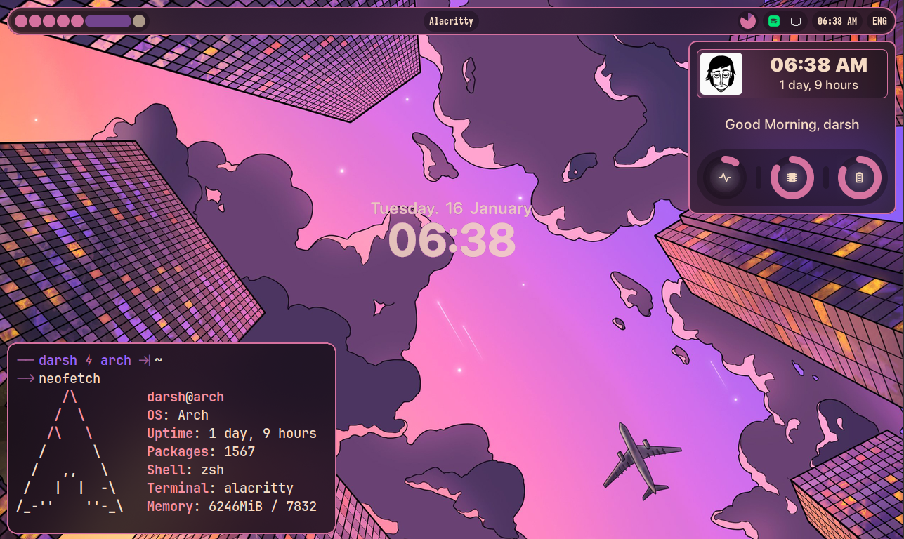

Ricing, Made <b>Easy</b> 🍚⚡

[<kbd>   Wiki Pages   </kbd>](https://wiki.ffpy.org) [<kbd>   Discord Server   </kbd>](https://discord.gg/3sDbYc9SZP)

---

## What's Fabric?

Fabric is a Desktop Widgets System that you can customize using Python. It offers a variety of features to make the often tedious process of creating widgets much easier and more enjoyable!

Our goal is to provide a high-level, signal-based workflow—no polling or bash scripting required for even the **most basic** tasks.

## Key Features

1. **Simple** yet **Powerful**
2. Supports both **X11 and Wayland**
3. Access to **all other Python modules**
4. Excellent **Developer Experience (DevEX)** and typing support
5. **Low resource usage**
   - Built-in Python code replaces the need for resource-heavy shell scripts

## Visual Tour

A Collection of Desktop rices that muscle-show what you are able to do using Fabric!

- Example files
  
- [Ax-Shell](https://github.com/axenide/Ax-Shell)
  
- [HydePanel](https://github.com/rubiin/HyDePanel)
  
- [Spacerice](https://github.com/SlumberDemon/dotfiles/tree/spacerice)
  
- [Fabrika - فابريكا](https://example.com)
  

## Hacking and Contributing

Interested in contributing? Check out the full guide in [our wiki pages](https://wiki.ffpy.org/contributing/hacking-guide/).
