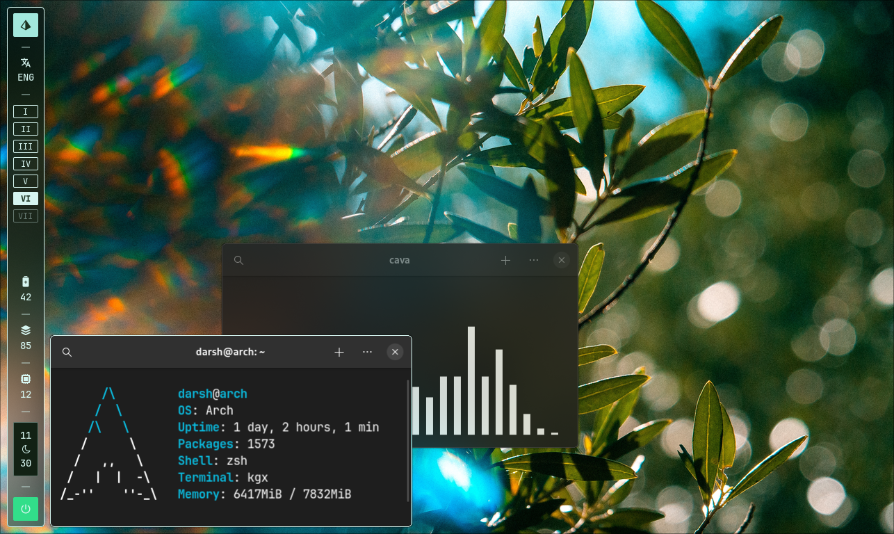

# Fabric
_**ricing made easy!**_ 🍙

Fabric is a Python widgets framework for *Nix based systems designed to provide a high-level and signal-based way to make awesome widgets. It's built on  [Cairo](https://www.cairographics.org) and [GTK](https://gtk.org), making powerful graphics features simple to use!

A quick example:

```python
import fabric
from fabric.widgets import Window, Label
Window(children=Label("Hello, World"), all_visible=True)
fabric.start()
```


## Features
* Simple as pie — a widget in just a few lines
* Powerful features make creating beautiful, dynamic, and interactive widgets divine
* Wayland and X11 ready!
* Access all your other beloved Python libraries
* [Code auto-completions supported](https://wiki.ffpy.org/installing-stubs.html)
* Signal-based flow; no polling required
* No external scripts necessary, meaning better performance — everything is done entirely in Python!
* Inspired from other projects on the community like [eww](https://github.com/elkowar/eww), [ags](https://github.com/Aylur/ags), and [Waybar](https://github.com/Alexays/Waybar), providing a familiar experience

## Installation
See the [installation guide](https://wiki.ffpy.org/installation-guide.html).

## Documentation and Support

> [!NOTE]
> Fabric (as well as its documentation) is still a work in progress; the API is subject to change.

Fabric's [documentation](https://wiki.ffpy.org) has next steps after installation, tutorials, and references, and is hosted in a [dedicated GitHub repository](https://github.com/Fabric-Development/fabric-wiki).

If you have questions or want to talk about Fabric, feel free to [join us on Discord](https://discord.gg/3sDbYc9SZP)!

## Contributing
See Fabric's [developer guide](https://wiki.ffpy.org/hacking-guide.html) over at the wiki. This covers how to contribute, [how to set up a development environment](https://wiki.ffpy.org/development-environment.html), and this project's [code style guidelines](https://wiki.ffpy.org/code-style-guide.html).

## Showcase

config: [examples/bar](examples/bar/) and [examples/side-panel](examples/side-panel/)


config: [examples/vertical-bar](examples/vertical-bar/)

